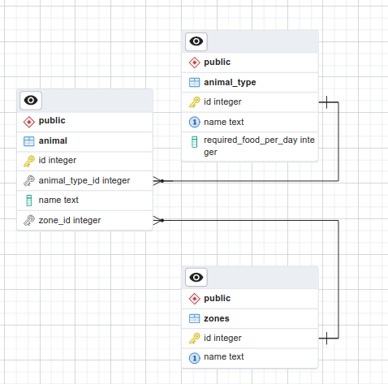

# Zoo project

Short description

This is the minimalistic Zoo project. It's very simple CRUD application where you can add zones, animal types and animals.

ERD Diagram



OpenApi Documentation
```
https://app.swaggerhub.com/apis/MrPickle311/Zoo/1.0.0
```


How to build it:

```
mvn clean package
```

How to run tests

```
mvn test
```

How to run application

```
java -jar target/zoo.jar
```

How to build as docker image

```
docker build -t zoo .
```

How to run docker container

```
docker run -p 5678:5678 -d zoo
```